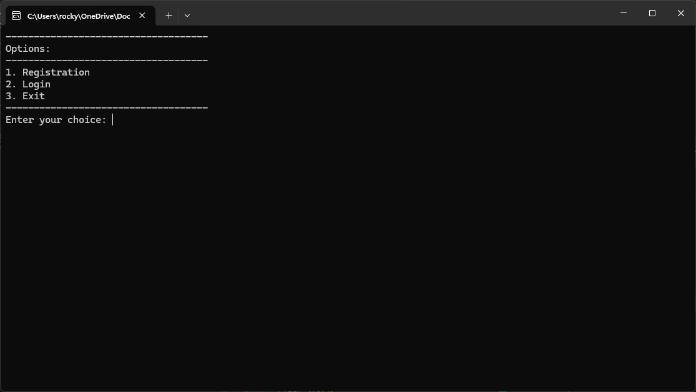
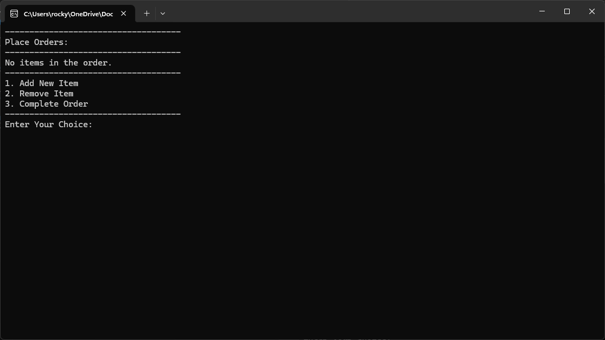
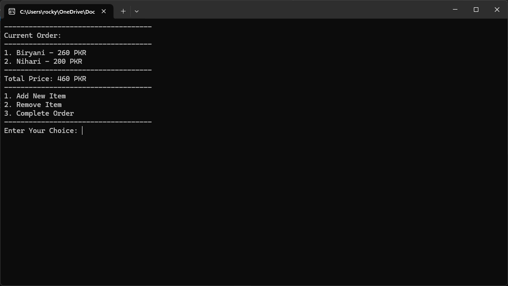

# 🍽️ Restaurant Management System

## 📌 About This Project
This is a basic console-based Restaurant Management System built using C++.
The project was created as a learning experience and to help teach fellow classmates 🎓 about file handling, user authentication, and basic console UI in C++.

---

## ✨ Features
- 🔐 User Registration & Login
- 🔒 Secure password input (hidden input)
- 🛒 Order placement system
- 📊 Order tracking and completion
- 💾 Employee data persistence using file storage

---

## 🛠️ Technologies Used
- 🖥️ C++
- 📂 File Handling
- 🎨 Console-based UI

---

## 🚀 How to Run
1. ⚙️ Compile the program using a C++ compiler (e.g., g++ or Visual Studio).
2. ▶️ Run the executable file.
3. 📝 Register a new employee or log in with an existing account.
4. 🍽️ Start placing and managing orders.

---

## 📁 Folder Structure
```
RestaurantManagementSystem/
│-- 📂 data/                  # Folder for storing employee data
│-- 📝 main.cpp               # Main source code file
│-- 📖 Readme.md              # Project documentation
```

---

## 📸 Screenshots

### 🔑 Login Screen


### 🛒 Order Placement


### 📊 Order Summary


---


## 📢 Notes
- This project was designed to introduce classmates to fundamental programming concepts in C++.
- It serves as a simple yet practical example of structuring a console-based application.

---

## 🔮 Future Improvements
- 🗄️ Implement database integration instead of file-based storage.
- 🖼️ Add graphical UI using a framework like Qt or WinForms.
- 🔑 Enhance security with password hashing.
- 📦 Improve order management with additional features.
